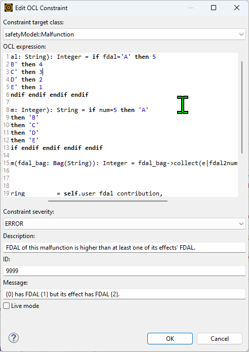

# Hierarchical FDAL check rule
The validation rule, as known as dynamic constraints used for validation in medini analyze, checks whether any FDAL of malfuctions from a lower level is more severe than that from a higher level.  
> For instance, there are 2 malfunctions. Malfunction `MF-001` is of airplane level(higher) and malfunction `MF-002` is of system level(lower). If `MF-001`'s FDAL is C, then `MF-002`'s FDAL can only be C or D. If `MF-002`'s FDAL is A or B, they violate the rule so you will get an error return when using validation to check the project.  
>  
>Note: FDAL from the most severe to the less severe are A>B>C>D.

You are required to start the integration work with the Aerospace Best practice project, which you can get from `help` -> `examples` or [Online support page](https://medini.ansys.com/account/secured?returnurl=/Views/Secured/samples.html)

## Dynamic constraints
Add this dynamic constraint to your dynamic constraints in project setting.
```OCL
-- Constraint target class: safetyModel:malfunction
-- Message: {0} has FDAL {1} but its effect had FDAL {2}.
def: fdal2num(fdal: String): Integer = if fdal='A' then 5
  else if fdal='B' then 4
  else if fdal='C' then 3
  else if fdal='D' then 2
  else if fdal='E' then 1
  else 9 endif endif endif endif endif
  
def: num2fdal(num: Integer): String = if num=5 then 'A'
  else if num=4 then 'B'
  else if num=3 then 'C'
  else if num=2 then 'D'
  else if num=1 then 'E'
  else 'n/a' endif endif endif endif endif

def: min_fdal_num(fdal_bag: Bag(String)): Integer = fdal_bag->collect(e|fdal2num(e))->min()

inv:
  let
    this_fdal:String         = self.user_fdal_contribution,
    has_effects:Boolean      = self.effects->notEmpty(),
    effects_fdal:Bag(String) = if has_effects then self.effects.getProfilePropertyValue('user_fdal_contribution')
      else Bag{9} endif,
    MessageArg1:String       = this_fdal,
    MessageArg2:String       = num2fdal(min_fdal_num(effects_fdal))
  in
    has_effects implies fdal2num(this_fdal) - min_fdal_num(effects_fdal) <= 0
```


## Profiling (Optional)
To improve the accessibility to verify the result, you can add a profiling, which shows all FDAL of malfunctions from the lower level.  
> Note that this profile only shows FDAL from one level lower, not including two or more levels lower, but it should be fine because if a FDAL of a malfunciton in two levels lower violates its grandparent's malfuction's FDAL, it must violates its parent's malfunction's FDAL
```JavaScript
// profiling: item definition -> malfunction
// name: user_effects_fdal
self.effects.getProfilePropertyValue('user_fdal_contribution')
```