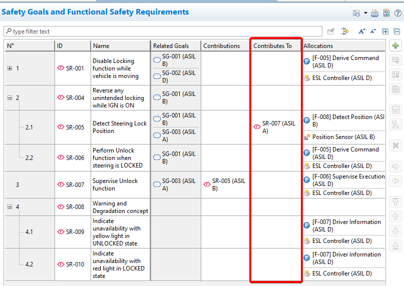
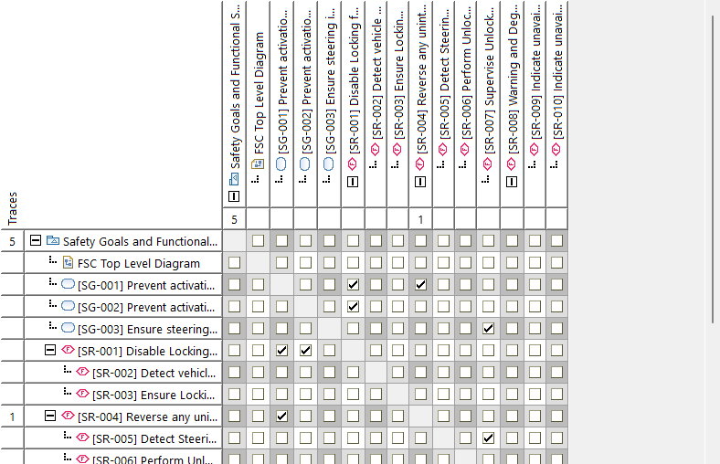
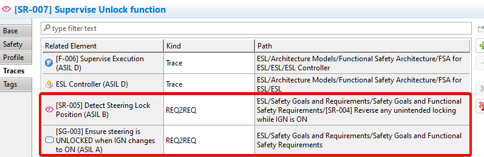
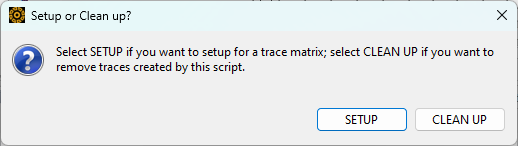

# Requirement to requirement trace matrix generator
This script generates trace matrix for `Contribute to` requirements.
There is a requirement model in the project like this.  
  

The script creates traces for them so users can get the trace matrix.
  

The traces created by the script are with kind `REQ2REQ`.
  

# Usage
1. Select the requirement models that include requirements you want to have traces.
2. Decide to `SETUP` or `CLEAN UP`. SETUP creates traces and CLEAN UP removes traces.
  

Note that `SETUP` also clean up the traces first then create the correspond traces.
