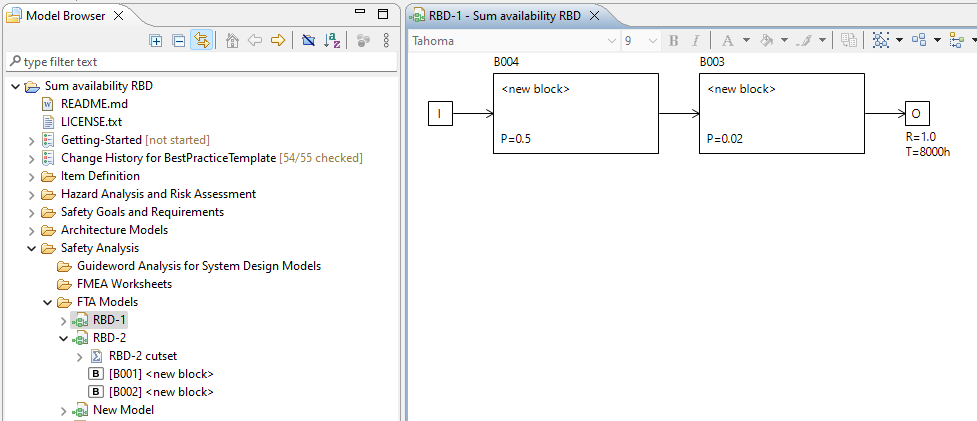
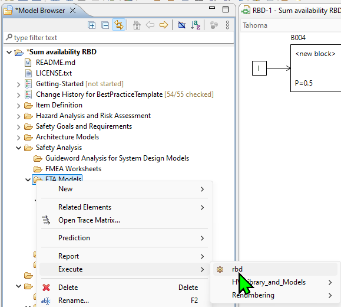
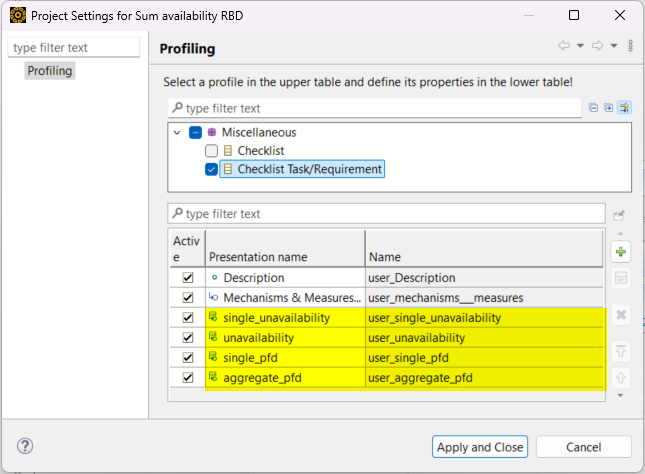

# Sum up RBD availability
## Procedure
Step 1. Get your RBDs ready in a pacakge.

Step 2. Execute the script on a pacakge that has multiple RBDs

Step 3. The checklist that has unavailability will be generated.

## Note
1. RBDs without a cutset will be ignored, since no information of unavailability.
1. If a RBD has more than one cutset, the script will be interrupted, since the script doesn't know which cutset users want to use. 
1. Two profiles defined in checklist should be setup if you want to use the script in your own project.

## Profile settings
`Miscellanous`->`Checklist Task/Requirement`

single_unavailability (Derived property, OCL):
`self.artifacts.oclAsType(rbd::RBDAnalysisModel).averageUnavailability`

unavailability (Derived property, OCL):
`1 - (self.artifacts.oclAsType(rbd::RBDAnalysisModel).averageUnavailability ->iterate(elem : Real; acc : Real = 1 | acc * (1-elem)))`

