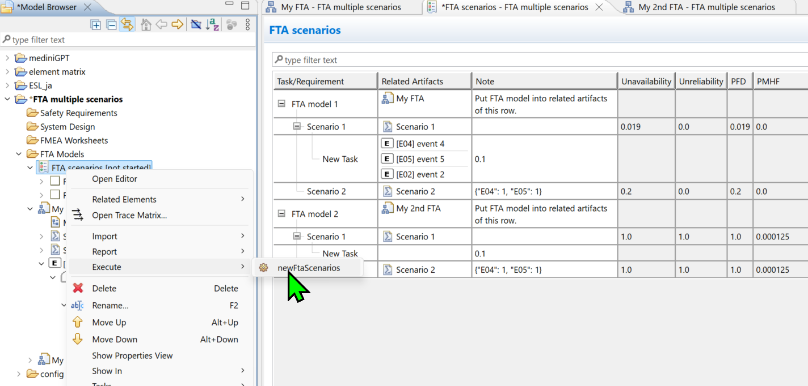

# FTA multiple scenarios

This customization allows users to evaluate FTA models with different probability combinations.  


# Installation

1. Download the mprx file.
2. Open the mprx file in medini analyze.
3. Use compare/merge function to transplant the settings and scripts.

   ```
    Source project: the mprx file
    Target project: your project

    Project settings/
        Checklist Templates/FTA scenarios
        Profiling/
            Unavailability
            Unreliability
            PDF
            PMHF

    Configuration File/scripts/
        newFtaScnarios.js
        .lib/fta.js
        .lib/factory.js
   ```

# Usage

1. Put all scripts in your project scripts folder.
2. Create a checklist in medini analyze.
3. Create a root-level checklist entry in that checklist, and put the evaluated FTA model in the artifacts field.
4. Create a level-1 checklist entry of the root-level checklist entry, keep the artifact field empty.
5. Create a level-2 checklist entry, put event nodes in the artifact field, and put value in note field. The value in note field will be the probability of the event nodes in that scenario.
6. Right-click on the checklist or the root-level checklist entry in the model browser, and execute the script `newFtaScenarios`.
7. The cutsets will be generated and fill to the corresponding level-2 entries.

# Tips and Notes

1. Check the sample mprx file. FTA models, checklists and checklist template are provided.
2. Users can put multiple event nodes in the same artifact field of level-2 checklist entries.
3. Probabilities of event nodes will be kept as what it was in the original FTA model if they are not specified in any artifact field .
4. Alternative way to set probabilities: put a JSON string in the note field of level-2 checklist entries (i.e. Scenario 2 in the screenshot). The JSON string should be in the format of `{"EVENT_NODE_ID":0.1,"EVENT_NODE_ID":0.2}`. The event nodes that are not specified in the JSON string will be kept as what it was in the original FTA model. With the default counter rules, the following JSON is valid.

   ```json
   { "E01": 0.1, "E02": 0.2 }
   ```

5. Users can put several FTA models in the same checklist. In that case several root-level checklist entries are needed. (i.e. FTA model 1 and FTA model 2 in the screenshot).
6. Users can select on a specific root-level checklist entry to execute the script (i.e. select on `FTA model 1` or `FTA model 2` only). The script will only generate cutsets for the selected root-level checklist entry and its level-1 and level-2 entries.
7. Users can select on a specific level-1 checklist entry to execute the script (i.e. select on `Scenario 1` only). The script will only generate cutsets for the selected level-1 checklist entry.
8. The cutset names are set to the name of the level-1 checklist entry. If the same cutset name exists, users get warning messages.
