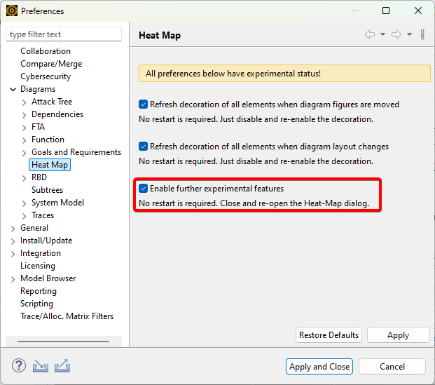

## Visualize Differences in the Diagram Editor

This script helps you see the differences directly in the diagram.  
For example, if you rename an element, add, delete, or update its description, or change its ASIL, these changes will appear in the diagram—not just as a list in the diff/merge editor.  

## Usage

1. Compare two projects as usual. In the Difference Browser, select an element that appears in a diagram, right-click it, and choose `execute` -> `visualizeDiff`.  
   

2. After running the script, the Heatmap script will be copied to your clipboard. Open the heatmap, set the category to `[Scripted]`, click the `...` button, paste the script, and click `Show Heat`.

## Note

- If `[Scripted]` does not appear in the heatmap dialog, enable it in the preferences.  
  

- You need to open the diagrams and adjust the layout yourself. Using right-click -> `Show Elements in Model Browser` can help with this.  
  
