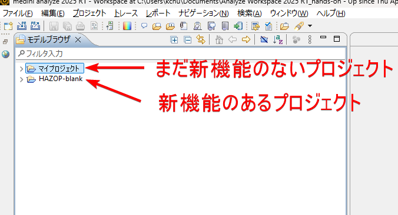
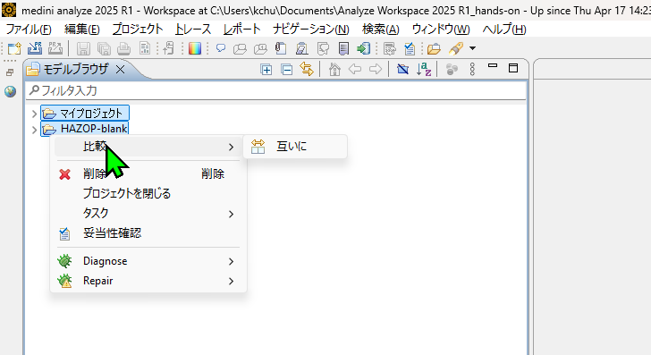
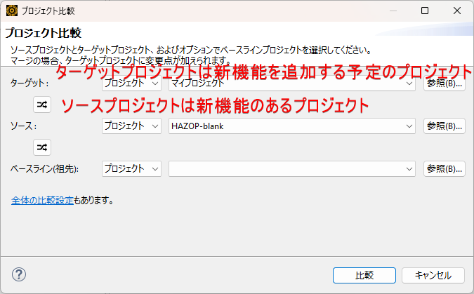
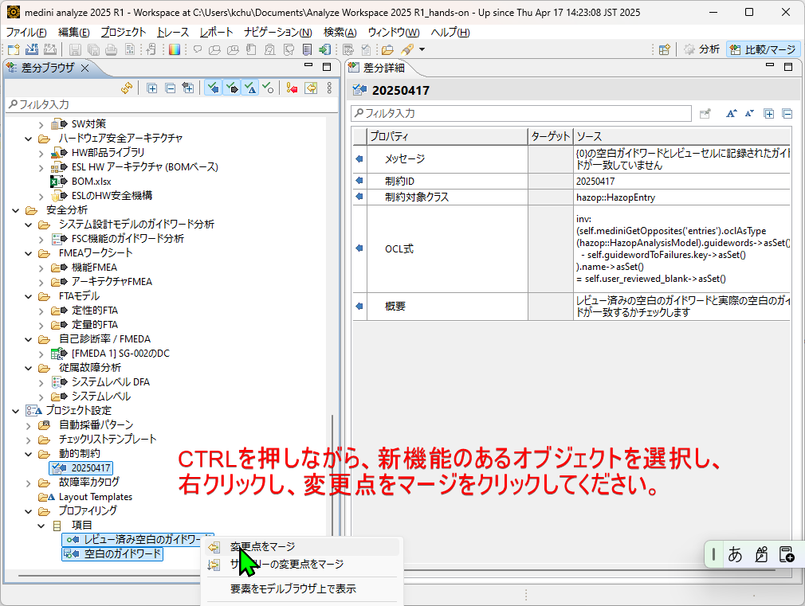
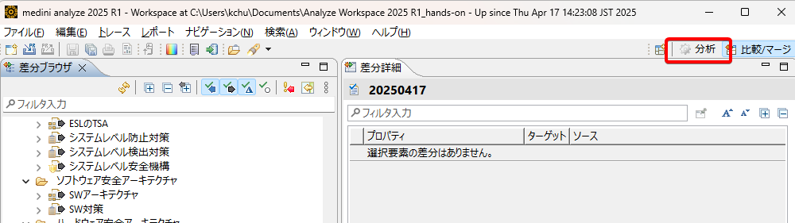
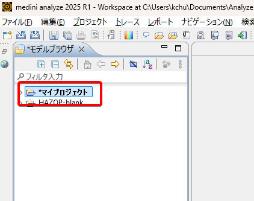

# medini analyze プロジェクトにカスタマイズ機能をインストールする方法
medini analyze はカスタマイズをサポートしており、独自のカスタマイズ機能を作成することも、他のプロジェクトからコピーすることも可能です。  
機能を簡単にコピーするには、medini analyze の`比較／マージ`機能を使用することができます。  

# 手順  
1. 対象のプロジェクトがあるワークスペースを開き、コピーしたいカスタマイズが含まれているプロジェクトをインポートします。  
  
2. モデルブラウザで `CTRL` キーを押しながら2つのプロジェクトを選択し、右クリックして `比較/互いに` を選択します。  
  
3. 「プロジェクトの比較」ダイアログで、**Target**（対象）をカスタマイズ機能を取り込む自分のプロジェクトに、**Source**（ソース）をカスタマイズを含むプロジェクトに設定します。  
  
4. `CTRL` キーを押しながらカスタマイズ機能を含むオブジェクトを選択し、右クリックして `変更点をマージ`を選択します。  
  

5. マージが完了したら、分析パースペクティブに戻ります。モデルブラウザ内の自分のプロジェクト名が太字で表示されていることを確認してください。プロジェクトを保存すると、ソースプロジェクトと同じカスタマイズ機能が使えるようになります。  
  
  
