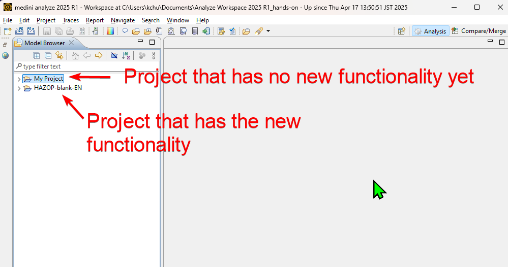
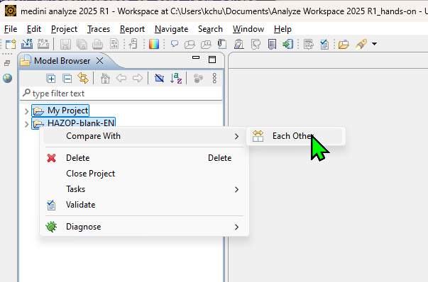
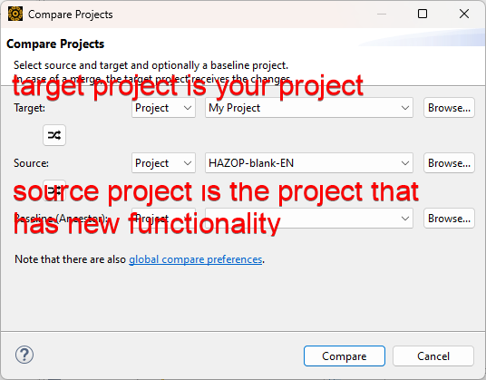
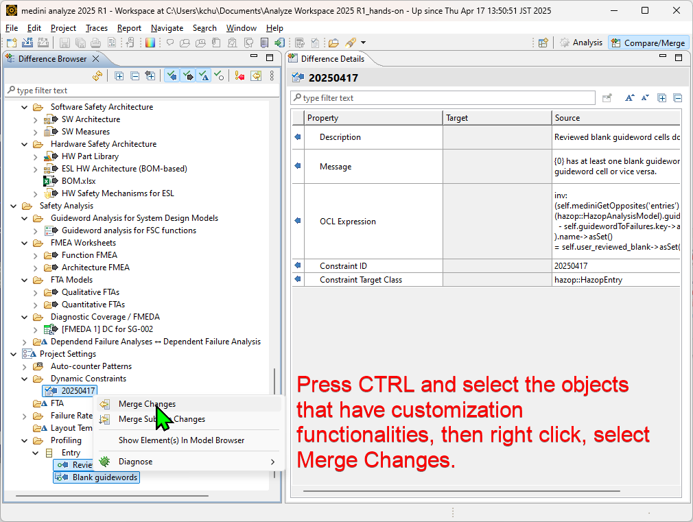
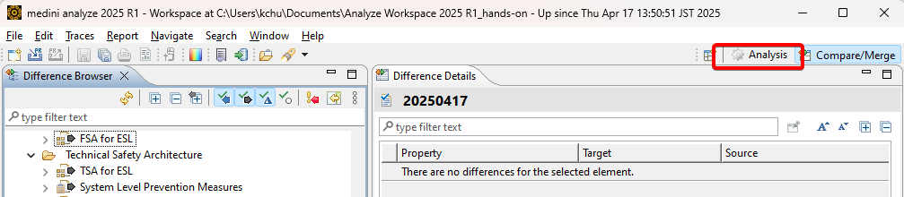
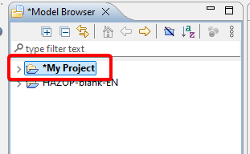

# How to install customization functionalities to your medini analyze projects
medini analyze supports customizations and you can create your own customization functionalities or copy from others' projects.  
To copy the functionalities easily, you can use `compare/merge` functionality of medini analyze.  
# Instruction
1. Open the workspace where your project in, and import the project that has the customization you want to copy.
  
2. Press `CTRL` while selection the two projects in model browser. Right click and select `Compare with/Each other`.  

3. In the compare projects dialog, set Target as your own project, which is going to get new functionalities, and Source as the project that has the functionalities you want to copy.  

4. Press `CTRL` and select the objects that have customization functionality, then right click and select `Merge Changes`.  

5. After merge, go back to the analysis perspective and your project listed in the Model Browser is bold. Save the project then your project has the same functionality as the source project now.

