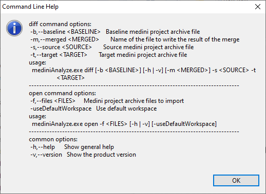

# Show medini command line parameters dialog 
To integrate medini analyze to your VCS (version control system), you need to know how to write the appropriate commands.  
To get the explanation about command line parameters, one can use the command `".\mediniAnalyze.exe" -h`.  

