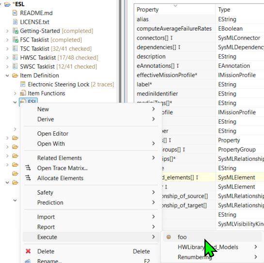
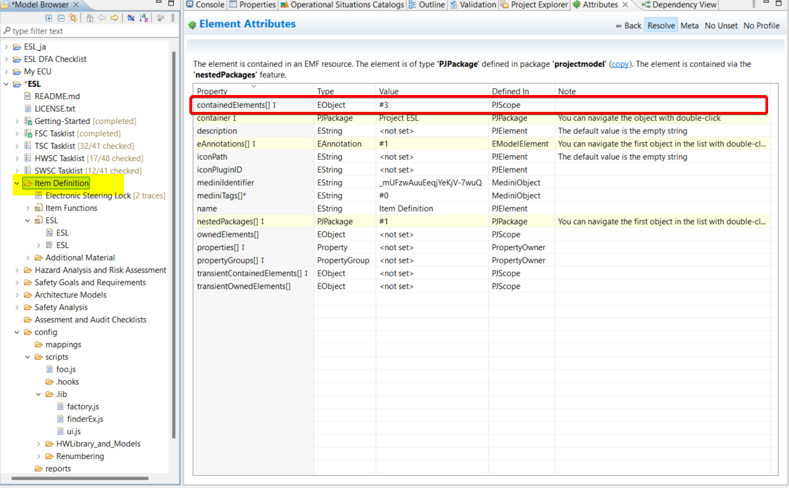
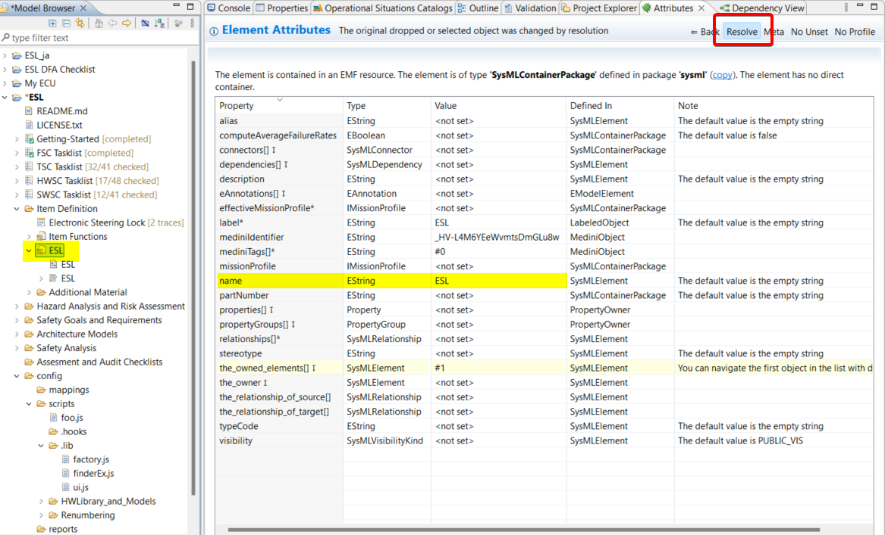
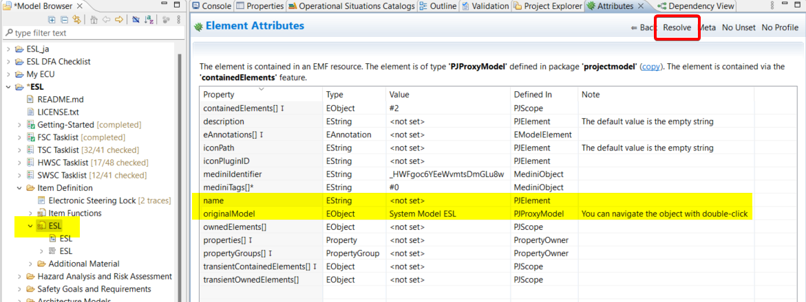
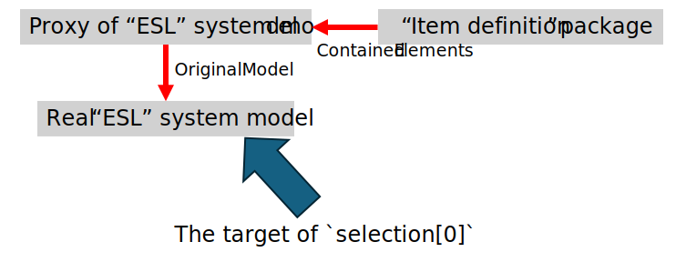

When you use `mediniGetOpposites` to get the source of a specific object, you might get an empty array, which surprises you.  
For example, you use `console.log(selection[0].mediniGetOpposites("containedElements"));` on the ESL sysmtem model (screenshot 1), and you expect to get the Item Definition package, since you see there is an attribute of Item Definition package called `containedElements` (screenshot 2).  

  
  

You will get an empty array, and the reason is that there is a proxy object to the real object.  
When you use `selection[0]` to manipulate the object, medini analyze executes your script on the destination object, not the proxy object.  
You can switch `Resolve` in the Attributes sheet to see the difference between the real object and the proxy object. Note that the name of the proxy object is `<not set>`, rather than the name you see in the model browser (screenshot 3 is the real object and 4 is the proxy object). If you execute the script `console.log(selection[0].name)`, you will get the name of the real object, which is not `<not set>`, because medini analyze uses the real object.  

  
  
So, to access the containedElements of the object, you need to do mediniGetOpposites to get its originalModel, then you can get the containedElements.  

```javascript 
console.log(selection[0].mediniGetOpposites("originalModel")[0].mediniGetOpposites("containedElements")[0].name);
```

To help you understand the above description. Here is the diagram to explain it visually.  

