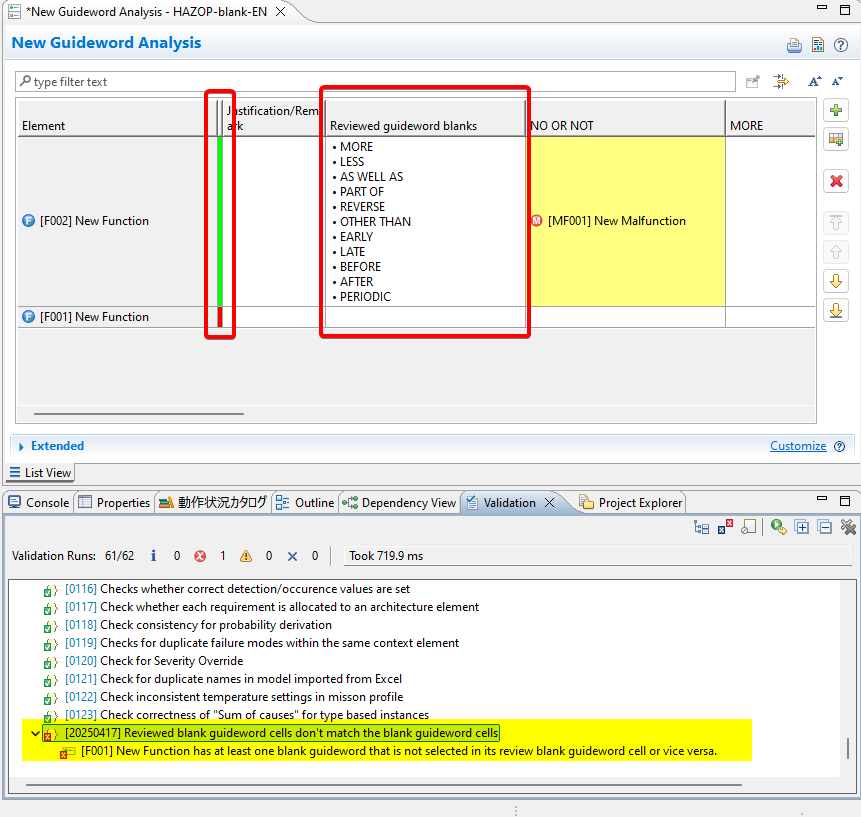
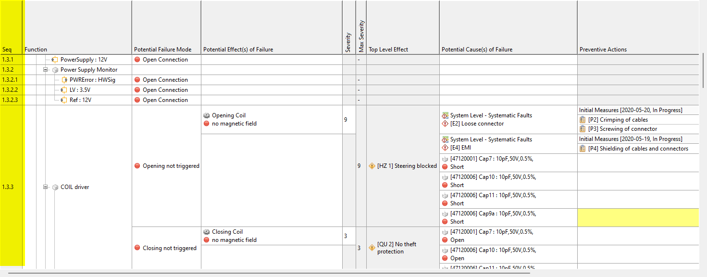
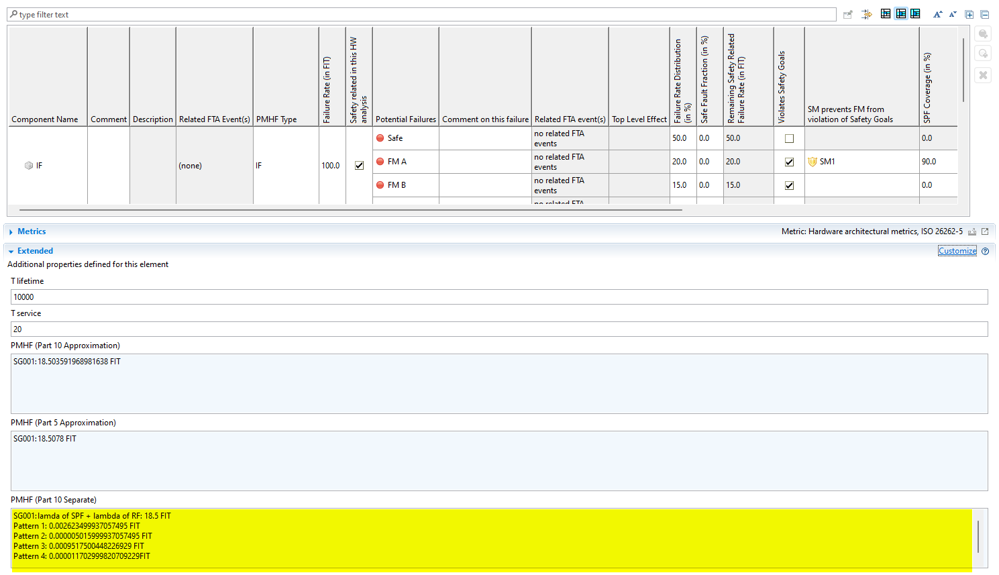
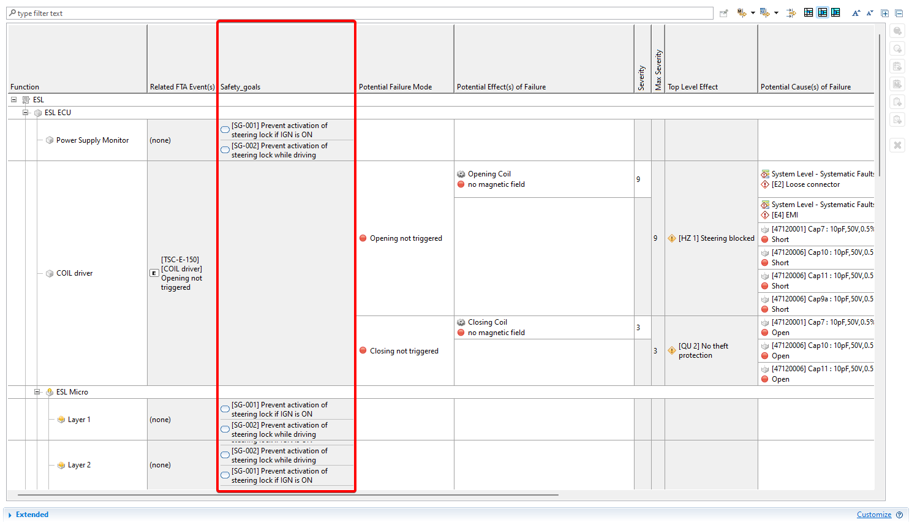
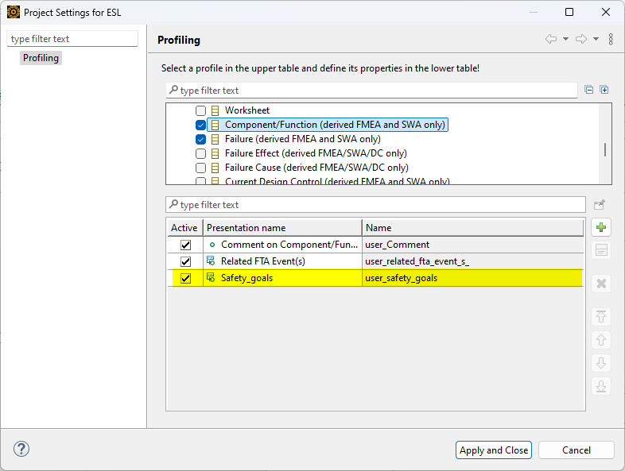

# Description
In this directory, useful derived profiles are documented.

# Check HAZOP's empty
  
[src](./check_HAZOP_empty)  
This customization allows users to check whether HAZOP entries have empty cells which has not been evaluated yet. If the entries have at least one empty cell which has not been evaluated, the color shows red, otherwise green. The dynamic constraint (i.e. validation rule) is also implemented.  
Note that the JavaScript file in the folder `.hooks` is optional. With it the color column will be updated automatically, but without it you can trigger the update by pressing `F5`.  
Check the above link for more details.  

# FMEA serial number

[profile](./FMEA_serial_number/profile.js)

# PMHF separate
The native sample project for PMHF approximation doesn't provide FIT of each pattern. This project provides this.

[src](./PMHF_separate)

# Show safety goals in FMEA
OCL
`self.element.oclAsType(sysml::SysMLPart).mediniGetTracedElements(safetygoals::SafetyRequirement).oclAsType(safetygoals::SafetyRequirement).contributedGoals`

Profiling -> FMEA Worksheets -> Component Function (derived FMEA and SWA only)

