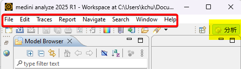

# How to assign medini analyze's UI language
Ansys medini analyze provides English and Japanese UI.  
The default UI will be the same as the Windows OS language. If your OS is Japanese UI, it will be Japanese. Else, it will be English.  

It is also possible to overwrite the language setting manually.  
- Force the program in English, use `"mediniAnalyze.exe" -nl en_US`  
  For example, assuming that the user wants to run the default installation directory`"C:\Program Files\ANSYS Germany GmbH\medini analyze 2025 R1.1\Program\mediniAnalyze.exe" -nl en_US`
- In Japanese, use `"mediniAnalyze.exe" -nl ja_JP`  
  `"C:\Program Files\ANSYS Germany GmbH\medini analyze 2025 R1.1\Program\mediniAnalyze.exe" -nl ja_JP`  

Sometimes, some texts of the UI don't refresh after you change the language. Like this,  

To ensure it refreshes, delete the following cache file in **the workspace folder**. `".metadata\.plugins\org.eclipse.e4.workbench\workbench.xmi"`

You can save a shortcut which including the parameter.  
Debug mode is still available with the above approach.
